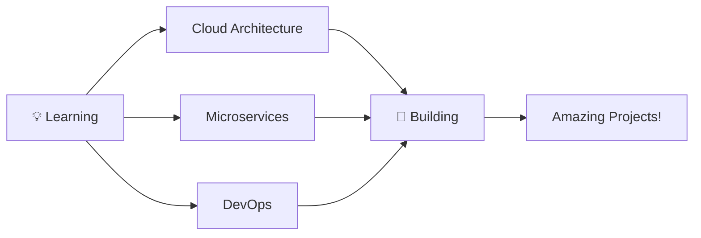

# 👋 Hi There! I'm Ronaldoss

<div align="center">
  
[](https://git.io/typing-svg)

</div>

<div align="center">
  
### 🌟 About Me

```typescript
const ronaldoss = {
    pronouns: "he" | "him",
    location: "Brazil 🇧🇷",
    education: "Systems Analysis and Development @ Uninter",
    currentFocus: ["Full Stack Development", "Cloud Technologies", "AI/ML"],
    funFact: "Almost a polyglot! 🌍",
    askMeAbout: ["Web Dev", "React", "TypeScript", "Python", "Java"],
    reachMe: "ronaldosssantos1@gmail.com"
};
```

</div>

---

## 📊 GitHub Stats

<div align="center">
  
  
</div>

<div align="center">
  
</div>

---

## 🛠️ Tech Stack

### 💻 Programming Languages

<div align="center">


</div>

### 🚀 Frameworks & Libraries

<div align="center">


</div>

### 🗄️ Databases & Cloud

<div align="center">


</div>

### 🛠️ Tools & Platforms

<div align="center">


</div>

---

## 🌍 Languages I Speak

<div align="center">

| Language | Level |
|----------|-------|
| 🇧🇷 **Portuguese** | Native |
| 🇺🇸 **English** | Fluent |
| 🇷🇺 **Russian** | Intermediate |

</div>

---

## 🎯 Currently Working On

<div align="center">


```mermaid
graph LR
    A[💡 Learning] --> B[Cloud Architecture]
    A --> C[Microservices]
    A --> D[DevOps]
    B --> E[🚀 Building]
    C --> E
    D --> E
    E --> F[Amazing Projects!]
```

</div>

---

## 🏆 GitHub Trophies

<div align="center">
  


</div>

---

## 📫 Connect With Me

<div align="center">

[](https://linkedin.com/in/yourprofile)
[](mailto:ronaldosssantos1@gmail.com)
[](https://github.com/Ronaldosdeltas)
[](https://yourportfolio.com)

</div>

---

<div align="center">

### 💭 Random Dev Quote


### 📊 Profile Views


### ⚡ Fun Fact

*"The best error message is the one that never shows up!"* 🚀

---

[](https://git.io/typing-svg)

</div>

---

<div align="center">
  
**⭐️ From [Ronaldosdeltas](https://github.com/Ronaldosdeltas) with ❤️**

</div>


